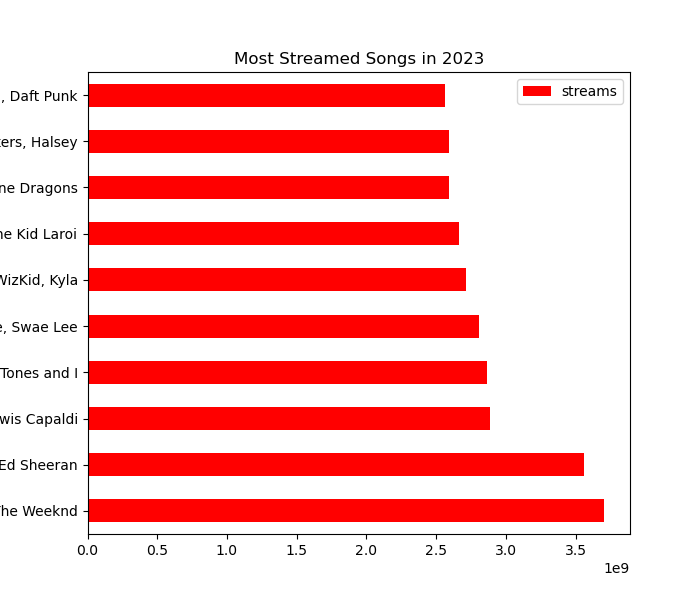
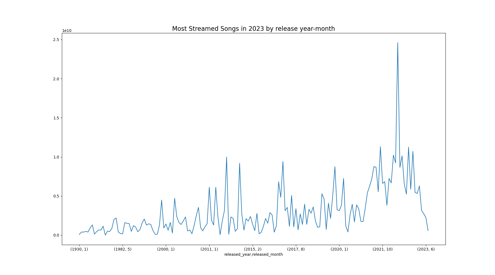

# Spotify Top Streamed Songs of 2023 Analysis

## Overview

This repository contains a data science project analyzing the Spotify Top Streamed Songs of 2023. The project aims to uncover trends, patterns, and insights from the dataset through comprehensive exploratory data analysis (EDA) and visualization.

## Dataset

The dataset includes information about the top streamed songs on Spotify in 2023, such as song title, artist, genre, release date, duration, and streaming count.

Dataset can be found here: [Kaggle Dataset](https://www.kaggle.com/datasets/nelgiriyewithana/top-spotify-songs-2023/data)

## Key Questions Explored

- Which songs and artists were the most popular in 2023?
- What are the trends in music genres among the top streamed songs?
- How does the release date and duration of a song affect its popularity?
- Are there any geographical trends in the top streamed songs?

## Tools and Technologies

- Python
- Pandas
- Matplotlib
- Seaborn

## Visualizations

Here are some of the visualizations created during the analysis:

## Conclusion

The analysis provides insights into the characteristics of the top streamed songs on Spotify in 2023, including popular artists, genres, and trends over time. For more detailed findings, please refer to the [analysis notebook](eda.ipynb).

## How to Run

Instructions on how to run the analysis notebook and reproduce the results.

## License

Specify the license under which the project is released.
